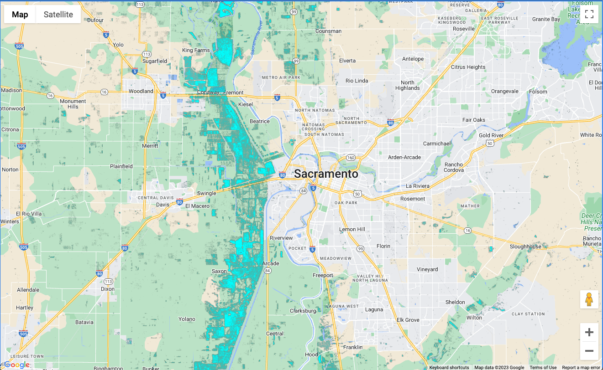
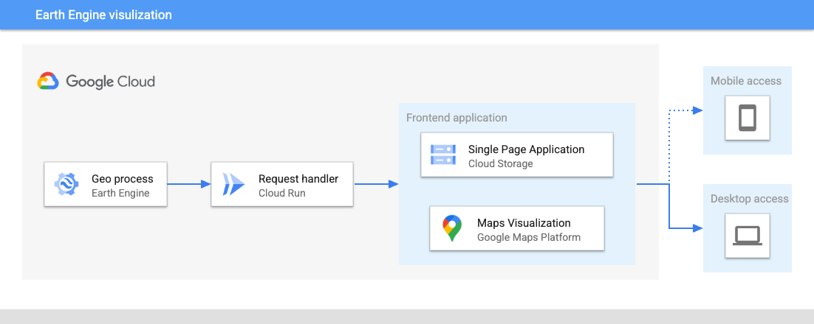

# ogc-ee-gmp-demo
Repo for a demo at the 2023 OGC Members Meeting highlighting Earth Engine and Google Maps Platform visualizations

This repo demostrates the code and Cloud setup for sharing results for an Earth Engine process/analysis on a simple webpage that is hosted on Cloud Storage. This example creates a flood map (cyan color) from the recent March 2023 flooding in California using Earth Engine and displayes in Google Maps.



## Setup

To get started, you will need:

1. `gcloud` installed ([installation instructions](https://cloud.google.com/sdk/docs/install))
2. A Google Cloud project ([get one here](https://console.cloud.google.com/projectcreate))
3. A Cloud storage bucket ([create one here](https://console.cloud.google.com/storage/create-bucket))
4. Earth Engine registered and enabled for your project ([register your project with EE here](https://code.earthengine.google.com/register))
5. A Google Maps Platform API key ([get a GMP API key here](https://console.cloud.google.com/google/maps-apis/credentials))

The architecture of the setup is shown in the following figure:



A few commands will be run to deploy the application and to customize for your project, you can set the following environmental variables:

```
export PROJECT=<your-project>
export APPNAME=ogc-demo-floods
export BUCKET=<your-cloud-bucket>
```

## Deploying application

The architecture is split into a backend and a frontend. The backend handles the Earth Engine calls and delivers the results to the frontend. The frontend is a simple single page application that displays the Earth Engine results on Google Maps.  

### Deploy backend to Cloud Run

Again, the backend handles the Earth Engine calls and delivers the results to the frontend. This is done by deploying a simple web server that gets a request, calls Earth Engine, and returns the map tiles. The backend is deployed on [Cloud Run](https://cloud.google.com/run) using a Docker image. To build and deploy the Docker image to Cloud Run, run the following commands:

```
cd src/backend
gcloud builds submit --tag gcr.io/$PROJECT/$APPNAME
gcloud run deploy $APPNAME --image gcr.io/$PROJECT/$APPNAME --platform managed --allow-unauthenticated
```

After the deploy command, you should see a service in the [Cloud Run page](https://console.cloud.google.com/run) with a healthy ✅ status.

### Build and store frontend on Cloud Storage

The frontend consists of a vanilla application for getting the tiles from the Cloud Run instances and displaying on Google Maps in a web browser.

Before deploying, you will need to update some of the parameters in code for your setup:

1. Update the `config.json` file to include the URL endpoint from Cloud Run that is taking the requests (if you are using the same code as this example, it should include `/get-map`). 
2. Update the `index.html` at line 64 to include your Google Maps Platform API key.

After adding in your information, run the following commands to build and push your single page application to Cloud Storage:

```
cd ../frontend
npm install
gsutil -m cp -r . gs://$BUCKET
```

Follow the steps for [hosting a static website](https://cloud.google.com/storage/docs/hosting-static-website) on Cloud Storage. 

After that is complete, *congratulations* 🎉 your application is running and ready to share!
